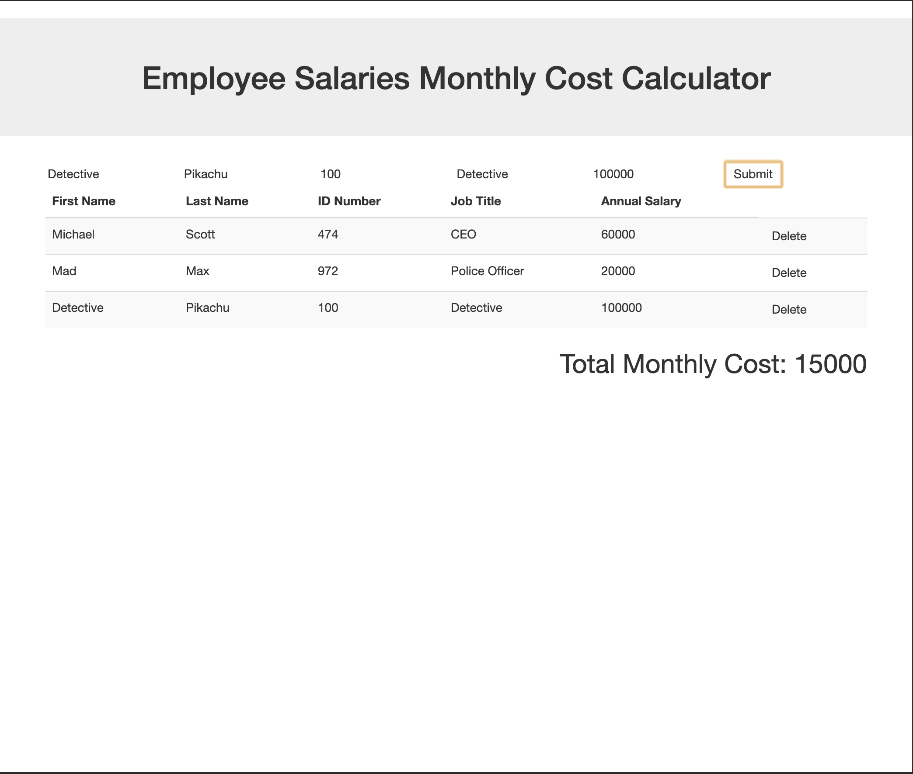

# Jquery Salary Calculator

## Description

Duration: 2 hour sprint with touchups over a weekend

I have written a salary calculator that compiles employee annual salaries and calculates the total monthly cost of having said employees. It allows a user to add and delete employees on the table. It will update the monthly 

## Visuals

## Usage

You may add or remove employees with the submit and delete buttons. The Annual Salary and ID fields expect numbers. You also cannot add an employee if they share an ID with somebody already in the table. 

## Roadmap

I am looking to add more functionality. A sort function for starters. Also a percentage field for each employee showing how much they contribute to the monthly budget. 
